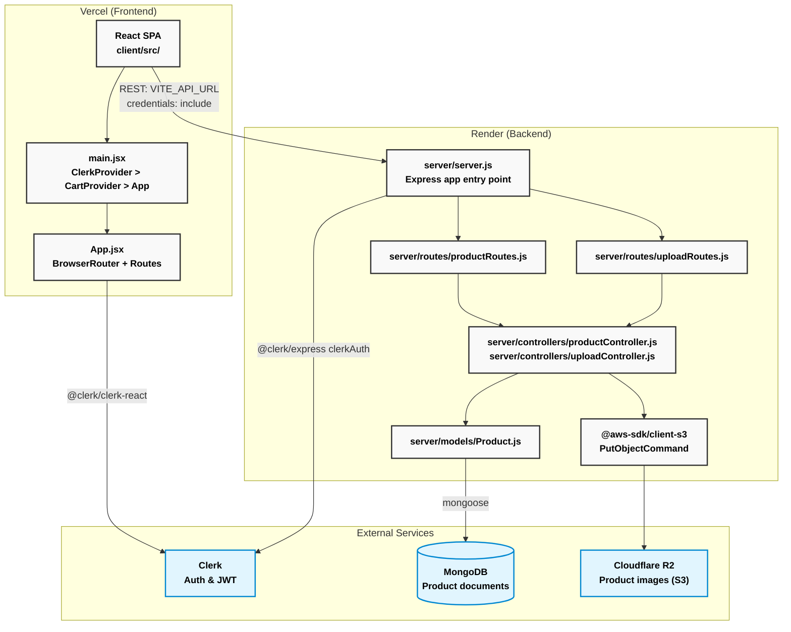
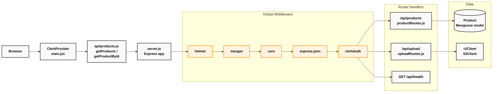

<div align="center">

# ⚡ ElectroMart

A modern full-stack e-commerce web application featuring intuitive product discovery, secure cart management, role-based access, and scalable cloud-native storage with AWS S3 and Cloudflare R2.


</div>

---

## 📑 Table of Contents

- [Overview](#overview)
- [Project Objectives](#project-objectives)
- [Architecture](#architecture)
  - [System Design](#system-design)
  - [Component Architecture](#component-architecture)
- [Technology Stack](#technology-stack)
- [Features](#features)
- [Getting Started](#getting-started)
- [API Documentation](#api-documentation)
- [Deployment](#deployment)
- [Project Structure](#project-structure)
- [Key Design Decisions](#key-design-decisions)
- [Contributing](#contributing)
- [License](#license)

---

## <a id="overview"></a>🔍 Overview

ElectroMart is a full-stack e-commerce web application built to demonstrate modern MERN stack practices in a production environment. The project implements a complete shopping cart flow, role-based access control (Admin vs. Customer), cloud-native image storage, robust CORS security, and independent frontend/backend deployments via Vercel and Render.

---

## <a id="project-objectives"></a>🎯 Project Objectives

- Implement secure, stateless authentication and authorization using Clerk.
- Demonstrate modern React patterns with hooks, context, and Vite tooling.
- Establish scalable image management using AWS SDK and Cloudflare R2.
- Build a responsive, highly polished UI utilizing Tailwind CSS and Framer Motion.
- Apply secure API design principles in Node.js/Express.
- Follow architectural best practices for monorepo configuration and CI/CD.

---

## <a id="architecture"></a>🏗️ Architecture

### System Design
The diagram below maps the major runtime components to the code files and external services they correspond to.

**Deployable Units and Their Code Roots:**


### Component Architecture
The application follows a layered architecture pattern separating concerns across the stack:
- **Presentation Layer (Client):** React components, React Router mapping, and Context-driven state management.
- **API Routing Layer (Server):** Express routers mapping HTTP endpoints to controllers.
- **Controller Layer (Server):** Business logic executing product management and cart validation.
- **Data Access Layer (Server):** Mongoose models for MongoDB interactions.
- **Security Layer:** Clerk authentication middleware guarding protected routes.
- **Infrastructure Layer:** Cloudflare R2 bucket for images, Vercel/Render for edge deployments.

**Request Path from Browser to Data Layer:**


---

## <a id="technology-stack"></a>💻 Technology Stack

### Frontend Core (`client/src/`)
| Category          | Technology                     | Version   |
|-------------------|--------------------------------|-----------|
| **UI Framework**  | React + React DOM              | `^19.2.0` |
| **Build Tool**    | Vite + `@vitejs/plugin-react`  | `^7.x`    |
| **Routing**       | React Router DOM               | `^7.13.0` |
| **Styling**       | Tailwind CSS                   | `^3.4.19` |
| **Animations**    | Framer Motion                  | `^12.x`   |
| **HTTP Client**   | Axios                          | `^1.13.5` |
| **Authentication**| `@clerk/clerk-react`           | `^5.61.1` |
| **Misc UI**       | Swiper (Carousel), Lucide React| Latest    |

### Backend Core (`server/`)
| Category          | Technology                     | Version   |
|-------------------|--------------------------------|-----------|
| **HTTP Framework**| Express                        | `^5.2.1`  |
| **Database ODM**  | Mongoose                       | `^9.2.1`  |
| **Authentication**| `@clerk/express`               | `^1.7.76` |
| **Image Storage** | `@aws-sdk/client-s3` (R2)      | `^3.x`    |
| **File Uploads**  | Multer                         | `^2.1.0`  |
| **Security**      | Helmet                         | `^8.1.0`  |
| **Logging**       | Morgan                         | `^1.10.1` |
| **CORS**          | cors                           | `^2.8.6`  |

---

## <a id="features"></a>✨ Features

### Security Implementation
- **JWT-based stateless authentication** managed entirely by Clerk.
- **Role-based access control (RBAC):** Dedicated Admin middleware ensuring only the designated admin can mutate product catalogs.
- **Comprehensive security headers** enforced via `helmet`.
- **Strict CORS policy** restricting backend access securely to the frontend origin.

### Core Functionality
- **Public Product Catalog:** Browse, search, and filter electronics by category, brand, or price.
- **Admin Dashboard:** Full CRUD operations for products directly from an intuitive UI interface.
- **Soft Deletion:** Products are marked inactive rather than hard-erased from the database to retain order history integrity.
- **Advanced Media Uploads:** Multi-image selection, real-time grid previews, and direct uploads to S3/Cloudflare R2.
- **Dynamic Cart Drawer:** Add, remove, and adjust generic quantities effortlessly without leaving the shopping context.
- **Responsive Layout:** Beautiful grid alignments that adapt effortlessly from mobile to desktop. 

### DevOps Implementation
- **Independent Monorepo Workspaces:** Clean separation of frontend and backend package dependencies.
- **Automated Deployments:** Continuous deployments handled via GitHub actions, Vercel (frontend), and Render (backend).
- **External Secret Management:** Strict `.env` parsing across both environments prohibiting accidental credential leaks.

---

## <a id="getting-started"></a>🚀 Getting Started

### Prerequisites
Required software installations:
- Node.js (v18 or higher)
- MongoDB Connection (Local or MongoDB Atlas)
- Clerk API Keys
- AWS S3/Cloudflare R2 Bucket Credentials

### Local Development Setup

Clone and configure the repository:
```bash
git clone https://github.com/Akil-Dikshan/electromart.git
cd electromart
```

**1. Configure the Backend**
```bash
cd server
npm install
```
Create a `.env` file in the `server` directory:
```env
PORT=5000
MONGODB_URI=your_mongodb_connection_string
CLERK_SECRET_KEY=your_clerk_secret_key
ADMIN_USER_ID=your_clerk_admin_user_id
AWS_ACCESS_KEY_ID=your_aws_key
AWS_SECRET_ACCESS_KEY=your_aws_secret
AWS_REGION=auto
AWS_BUCKET_NAME=your_bucket_name
AWS_ENDPOINT=your_cloudflare_r2_endpoint
```

**2. Configure the Frontend**
```bash
cd ../client
npm install
```
Create a `.env` file in the `client` directory:
```env
VITE_API_URL=http://localhost:5000
VITE_CLERK_PUBLISHABLE_KEY=your_clerk_publishable_key
```

### Build and Run the Application

Open two terminal instances.

**Terminal 1 (Backend):**
```bash
cd server
npm run dev
```

**Terminal 2 (Frontend):**
```bash
cd client
npm run dev
```

Verify successful startup by visiting `http://localhost:5173`.

---

## <a id="api-documentation"></a>🔌 API Documentation

### Authentication Flow
The API utilizes `@clerk/express` for securing routes. Clients must provide a valid `Authorization: Bearer <token>` in the header for protected requests.

### Product Management Endpoints

**Retrieve Products (Public)**
Returns all *active* products.
```http
GET /api/products
```

**Retrieve All Products (Admin)**
Returns *all* products (including inactive/deleted).
```http
GET /api/products/admin/all
Authorization: Bearer {token}
```

**Create Product**
```http
POST /api/products
Authorization: Bearer {token}
Content-Type: application/json

{
  "name": "Wireless Headphones",
  "brand": "Sony",
  "price": 299.99,
  "category": "audio",
  "stock": 50,
  "images": ["url1", "url2"],
  "description": "Premium noise cancelling headphones"
}
```

**Update Product**
```http
PUT /api/products/{id}
Authorization: Bearer {token}
Content-Type: application/json

{
  "price": 279.99
}
```

**Delete Product (Soft Delete)**
Sets `isActive: false` on the product document.
```http
DELETE /api/products/{id}
Authorization: Bearer {token}
```

### Upload Endpoints

**Upload Images**
Accepts multipart form data.
```http
POST /api/upload
Authorization: Bearer {token}
Content-Type: multipart/form-data

[files attached (up to 5)]
```

---

## <a id="deployment"></a>🌐 Deployment

### Infrastructure
- **Frontend:** Hosted on **Vercel** for optimal global CDN delivery and instant preview deployments for pull requests.
- **Backend:** Hosted on **Render** (Node.js web service environment) offering seamless GitHub integration.
- **Database:** Hosted on **MongoDB Atlas** (Serverless/Dedicated clusters).
- **Storage:** **Cloudflare R2** via AWS SDK S3 commands to eliminate egress fees for heavy image loads.

### CI/CD Pipeline
Continuous deployment is directly hooked into the `main` branch. 
When code is merged to `main`:
1. **Vercel** intercepts client-side code changes, builds the Vite application, and distributes artifacts globally.
2. **Render** detects backend-side code changes, installs NPM dependencies, and restarts the Node/Express service.

---

## <a id="project-structure"></a>📂 Project Structure

```text
electromart/
├── client/                      # React Frontend
│   ├── src/                     
│   │   ├── api/                 # Axios HTTP client wrappers
│   │   ├── components/          # Reusable UI components
│   │   ├── context/             # Global Context API (Cart)
│   │   ├── pages/               # React Router route views
│   │   ├── App.jsx              # Main React routing map
│   │   └── main.jsx             # React DOM entry / Provider wrapping
│   ├── index.html               
│   ├── vite.config.js           
│   └── package.json             
├── server/                      # Node/Express API
│   ├── config/                  # DB and general configurations
│   ├── controllers/             # Business logic execution
│   ├── middleware/              # Auth, error, and validation interceptors
│   ├── models/                  # Mongoose Schemas
│   ├── routes/                  # Express route definitions
│   ├── utils/                   # Helper functions (AWS S3)
│   ├── server.js                # Express App entry point
│   └── package.json             
├── render.yaml                  # Render deployment configuration
└── .github/                     
```

---

## <a id="key-design-decisions"></a>🔑 Key Design Decisions

| Decision | Detail |
| :--- | :--- |
| **Monorepo Separation** | `client/` and `server/` are separate npm workspaces. They process independently preventing Node modules cross-contamination while allowing one PR for full-stack features. |
| **Soft deletes** | Products are never hard-deleted from MongoDB; an `isActive` flag controls visibility keeping order history and foreign keys intact. |
| **Volatile Storage Avoidance** | Render container disks are ephemeral. Uploading product images to Cloudflare R2 ensures persistence regardless of server restarts. |
| **Auth Boundary Push** | Avoiding custom passport integration or session storage significantly decreases API liability. Clerk SDK completely abstracts JWT rotation and 2FA features. |
| **Micro-authorization** | Rather than a full roles table, Admin access is verified against a single securely injected `ADMIN_USER_ID` environment variable mapping to Clerk’s authentication identity. |

---

## <a id="contributing"></a>🤝 Contributing

**Development Workflow:**
1. Fork the repository
2. Create your feature branch: `git checkout -b feature/AmazingFeature`
3. Commit your changes: `git commit -m 'Add some AmazingFeature'`
4. Push to the branch: `git push origin feature/AmazingFeature`
5. Open a Pull Request

---

## <a id="license"></a>⚖️ License

This project is licensed under the ISC License.

<div align="center">
  <br/>
  <p>⬆ <a href="#-electromart">Back to Top</a></p>
  <p>Made with ❤️ by <strong>Akil Dikshan</strong></p>
</div>
